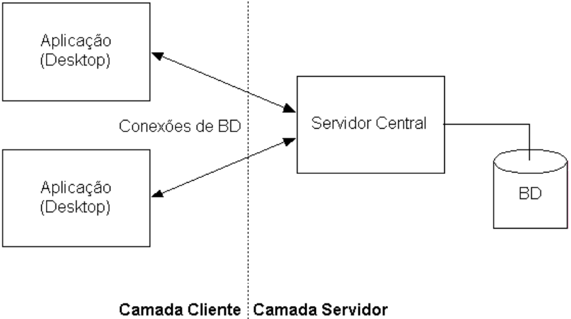
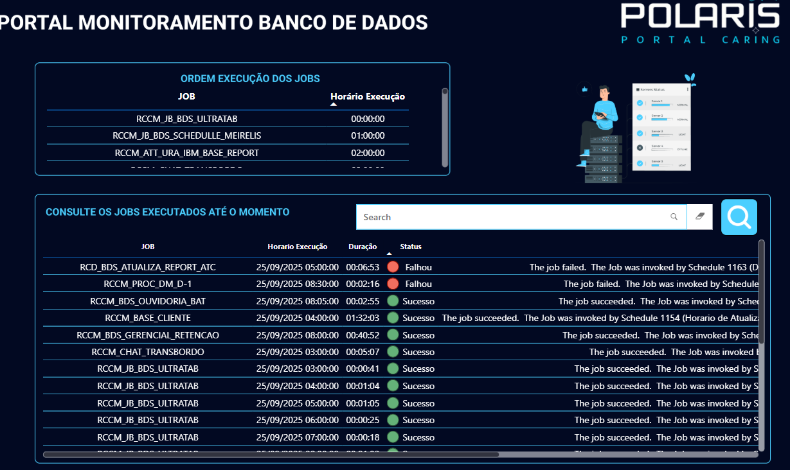
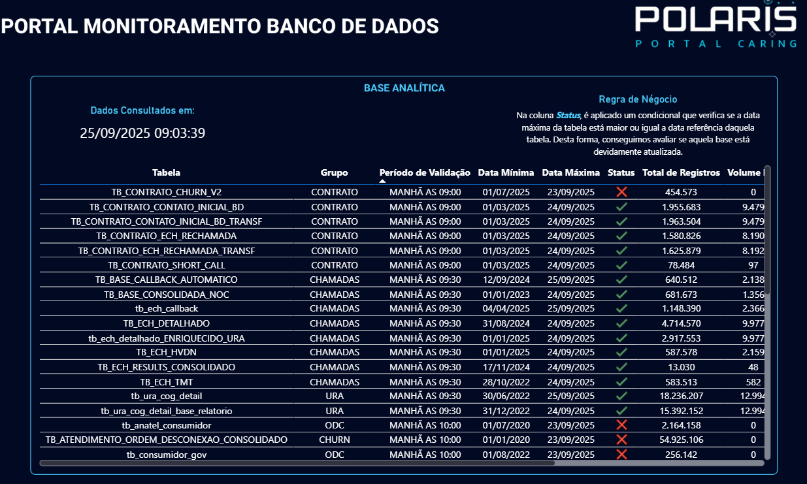

# Painel de Monitoramento de Banco de Dados 📊

## 1. Descrição Geral

O Painel de Monitoramento Banco de Dados BDS é um sistema desenvolvido com o objetivo de monitorar a integridade, execução e desempenho dos jobs, tabelas e processos de um banco de dados SQL Server.

Ele oferece uma visão consolidada e em tempo quase real das principais rotinas e estruturas críticas do banco, permitindo identificar falhas, atrasos e inconsistências de maneira rápida e eficiente.

## 2. Objetivos

* Centralizar informações de execução de jobs e status de tabelas.

* Facilitar o acompanhamento do ambiente de banco de dados pelos time de analytics.

* Reduzir o tempo de resposta em incidentes de falha ou atraso em processos.

## 3. Ferramentas Utilizadas

| Camada         | Tecnologia                                              | Descrição                                    |
| -------------- | ------------------------------------------------------- | -------------------------------------------- |
| Banco de Dados | SQL Server                                              | Armazena dados das tabelas, jobs e processos |
| Back-End       | SQL e Python                                            | Procedures, consultas e conexão com banco de dados |
| Front-End      | Dashboard | Interface visual para monitoramento e análise                  |
| Infraestrutura | Nuvem                                                   | Hospedagem do sistema    |

## 4. System Design

### 4.1 Arquitetura do sistema

O sistema é composto por três camadas principais:

* **Banco de Dados**
  * Repositório central com as informações consolidadas.
  * Armazena logs, status de jobs e dados para monitoramento dos objetos do banco.
* **Back - End**
  * Responsável pela extração, transformação e carga dos dados monitorados.
  * Realiza consultas e procedures para carga dos dados.
  * Alimenta o banco de dados BDS atráves do banco externo msdb. que é a base de informações do painel.
* **Front - End**
  * Interface visual para acompanhamento das informações.
  * Exibe tabelas e indicadores de status dos processos e tabelas.
  * Permite filtragem e consulta de eventos históricos.

## 5. Funcionalidades do Sistema

* **Monitoramento de Jobs**

  * Identifica jobs com falha, sucesso ou em execução.

  * Permite acompanhar o histórico de execuções.

* **Monitoramento de Tabelas**

  * Executa consultas específicas para verificar volume de dados e consistência.

  * Permite identificar tabelas críticas ou com anomalias.

* **Monitoramento de Processos**

  * Avalia a execução de rotinas automáticas e fluxos internos do banco.

* **Logs e Alertas Visuais**

  * Exibição de alertas e status por cores e indicadores no dashboard.
  * Registro de logs para auditoria e acompanhamento técnico.

## 6. Demonstração do sistema

* **Interface para Acompanhamento dos Jobs do banco armazenados no SQL Server Agent Jobs**
  
Fornecer uma visão consolidada das execuções de jobs, permitindo identificar falhas, sucessos e horários de execução de forma rápida e visual, facilitando a tomada de decisão e o diagnóstico de incidentes.
Certamente, aqui temos em tempo real, o status de execução dos jobs do banco de dados SQL Server, permitindo que a equipe de analytics acompanhe facilmente o funcionamento das rotinas automatizadas do ambiente.

* **Tela para monitoramento das tabelas do banco de dados**

Fornecer uma visão consolidada das principais tabelas do banco de dados, exibindo indicadores que demonstram se cada tabela foi atualizada dentro do prazo definido pelas regras de negócio.
Essa visualização permite identificar atrasos, falhas de carga ou inconsistências em tempo real, contribuindo para a qualidade e confiabilidade das informações corporativas.

## 7. Conclusão

O Sistema de Monitoramento Banco de Dados BDS representa uma solução estratégica para gestão e visibilidade das operações de um banco de dados, permitindo controle proativo, transparência e agilidade no acompanhamento de rotinas críticas.

